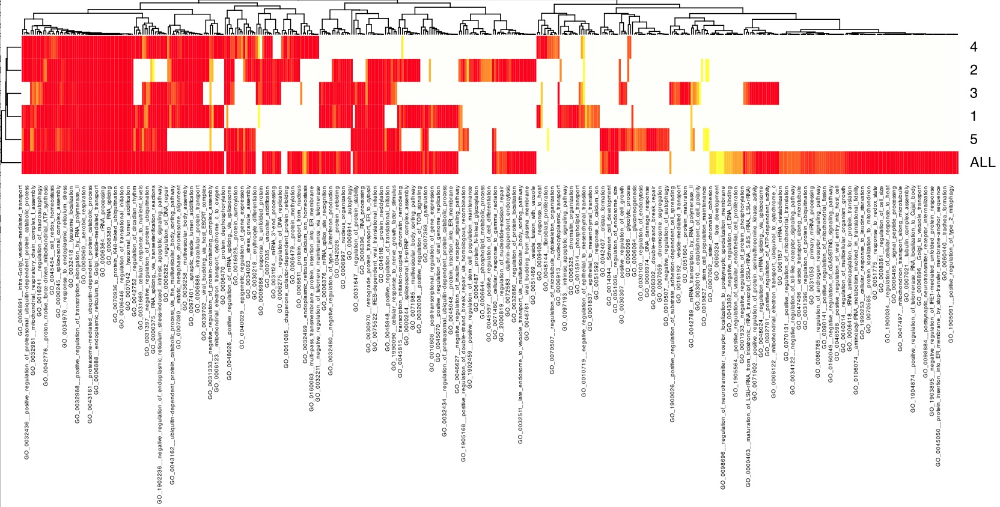

<style>
body {
text-align: justify;
font-size: 16pt;
font-family: Times;}
</style>

<p class=MsoNormal align=center style='text-align:center'><b style='mso-bidi-font-weight:
normal'><span style='font-size:16.0pt;font-family:"Times New Roman",serif;
color:red'>High Throughput GoMiner (HTGM)<o:p></o:p></span></b></p>

<p class=MsoNormal align=center style='text-align:center'><b style='mso-bidi-font-weight:
normal'><span style='font-size:16.0pt;font-family:"Times New Roman",serif'><o:p>&nbsp;</o:p></span></b></p>

<p class=MsoNormal align=center style='text-align:center'><b style='mso-bidi-font-weight:
normal'><span style='font-size:16.0pt;font-family:"Times New Roman",serif'><o:p>&nbsp;</o:p></span></b></p>

<p class=MsoNormal align=center style='text-align:center'><b style='mso-bidi-font-weight:
normal'><span style='font-size:16.0pt;font-family:"Times New Roman",serif'>Barry
Zeeberg<o:p></o:p></span></b></p>

<p class=MsoNormal align=center style='text-align:center'><b style='mso-bidi-font-weight:
normal'><span style='font-size:16.0pt;font-family:"Times New Roman",serif'>barryz2013@gmail.com<o:p></o:p></span></b></p><br>

<p class=MsoNormal style='text-align:justify'><span style='font-size:16.0pt;
font-family:"Times New Roman",serif'></p><br>

<p class=MsoNormal align=center style='text-align:center'><b style='mso-bidi-font-weight:
normal'><span style='font-size:16.0pt;font-family:"Times New Roman",serif'>Motivation<o:p></o:p></span></b></p>


My previously published paper (Zeeberg, B.R., Qin, H., Narashimhan, S., et al. (2005) <doi: 10.1186/1471-2105-6-168>) includes a complete presentation of High Throughput GoMiner (HTGM), so I will only give a brief motivation here, and a few results to provide proof of concept for this particular implementation.

There are 4 CRAN packages that together comprise the GoMiner suite. These include the present package ‘High Throughput GoMiner (HTGM),’ ‘GoMiner’ and ‘minimalistGODB,’ as well as the upcoming package (expected March 2025) ‘Two Dimensional High Throughput GoMiner (HTGM2D).’

The output of GoMiner is a heatmap showing the relationship of a single list of genes and the significant categories into which they map. HTGM integrates the results of the multiple related GoMiner analyses. The output of HTGM is a heatmap showing the relationship of the significant categories derived from each individual GoMiner analysis.

The visualization is saved using the Scalable Vector Graphics (SVG) technology, which provides a web-friendly vector image format that uses mathematical formulas to define shapes and colors, allowing for crisp, scalable graphics without loss of quality, unlike pixel-based images. SVG is also more flexible than other formats in accommodating the large images that often are required for displaying the HTGM heatmaps (without truncating the rather long category names).

The heatmap has only 2 axes, so the identity of the genes are unfortunately 'integrated out of the equation.' Because the graphic for the heatmap is implemented in Scalable Vector Graphics (SVG) technology, it is relatively easy to hyperlink each picture element to the relevant list of genes. By clicking on the desired picture element, the user can recover the 'lost' genes. 
<br><br>
<p class=MsoNormal align=center style='text-align:center'><b style='mso-bidi-font-weight:
normal'><span style='font-size:16.0pt;font-family:"Times New Roman",serif'>Results<o:p></o:p></span></b></p>

Normally HTGM is used for analyzing the results of several related experiments, but here I will illustrate using it to analyze non-experimental 'conceptual' gene sets. There is a fairly large set of 2883 genes, referred to as 'housekeeping genes,' that can be downloaded as an .RData file from https://housekeeping.unicamp.br/?download . Since the entire human genome is comprised of around 20,000 genes, this set represents well over 10% of the human genome, and it is much larger than typical GoMiner or HTGM genes sets that may range from a few dozen to a few hundred genes.

In addition to the important biological question of characterizing the categories related to housekeeping genes, we can also take advantage of the large size of the gene set to compare the results of random subsets. That is, do we find essentially the same categories with just a portion of the gene set? After all, in reality an experimental gene set may very well be incomplete, either because of the limitations/noise of the experiment, or incomplete annotations in the underlying genomics databases.

```
sampleList<-unique(as.matrix(Housekeeping_Genes[,"Gene.name"]))
n<-nrow(sampleList)
sampleLists<-list()
# test the effect of random sampling of the entire gene set
# this can give an idea of the quality of the GoMiner results
# when the complete gene set is yet to be determined
sampleLists[["1"]]<-sampleList[sample(n,n/2)]
sampleLists[["2"]]<-sampleList[sample(n,n/2)]
sampleLists[["3"]]<-sampleList[sample(n,n/2)]
sampleLists[["4"]]<-sampleList[sample(n,n/2)]
sampleLists[["5"]]<-sampleList[sample(n,n/2)]
sampleLists[["ALL"]]<-sampleList
m<-HTGM(title=NULL,dir=tempdir(),sampleLists,GOGOA3,
  ONT="biological_process",enrichThresh=2,countThresh=5,
  fdrThresh=0.10,nrand=100)
```

The HTGM heatmap is shown in Figure 1. The color scale represents the false discovery rate (FDR) of the category, with bright red corresponding to the most significant FDR close to 0.00, and the light background color corresponding to the fdrThresh of 0.10.

Because of the large number of categories, it is difficult to present this in an easily readable form within this document, so the original 'hyperlink.svg', which can be expanded within *e.g.* Safari, is available in the inst/extdata subdirectory. Also, if you open the .svg in Safari, you can click a picture element to see the underlying genes.


<br><br>
{width=300%}

Figure 1. HTGM heatmap (containing clickable hyperlinks to reveal hidden gene lists) for housekeeping genes/subsets
<br><br>

Some of the categories show up in the full set and in all of the random subsets, but there are a large number of categories that show up only in the full gene set.

One of the components of the HTGM heatmap is the GoMiner analysis of the full set of housekeeping genes. This basic GoMiner analysis is of interest in itself. The corresponding heatmap is too large to include in the present document, but it is available as 'GoMiner_348_1438.svg' in the subdirectory inst/extdata .

The summary file 'thresh_348_1438.txt' (also in inst/extdata; please open this file with *e.g.* excel, in order to align the columns) is easier to look at than the heatmap. It shows *e.g.* that 109 housekeeping genes map to the category 'GO_0006412__translation.' To see the identities of these 109 genes, you can use the exhaustive 'gce_348_1438.txt' (also in inst/extdata).